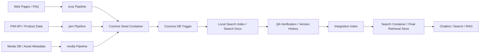

# RubiconTF

> Azure Functions 기반 멀티소스 RAG 데이터 파이프라인
>
> 웹 문서, 제품 API, 미디어 자산을 수집·정규화·검증한 뒤 Azure AI Search에 적재하는 운영형 백엔드 프로젝트입니다.

## 프로젝트 한눈에 보기

RubiconTF는 전자제품 도메인의 비정형 데이터를 검색/챗봇에서 활용할 수 있는 형태로 가공하는 데이터 파이프라인 저장소입니다.  
코드 기준으로 확인되는 핵심 역할은 다음과 같습니다.

- 웹 페이지와 FAQ를 크롤링해 검색 가능한 문서 청크로 변환
- 제품 API/PIM 데이터를 수집하고, 누락 시 크롤링으로 보완
- 이미지·동영상 메타데이터를 제품 정보와 결합해 미디어 검색 문서 생성
- 버전 단위로 Seed, Local, Integration, Search 반영 상태를 추적
- QA 샘플링과 검증 결과를 바탕으로 인덱스 반영 여부를 통제

즉, 이 저장소는 단순 크롤러가 아니라 `수집 -> 정규화 -> 청킹 -> 검증 -> 검색 인덱스 동기화`까지 포함한 **운영형 RAG 적재 시스템**에 가깝습니다.

## 어떤 문제를 푸는가

제품 정보는 보통 한 곳에만 있지 않습니다. 실제 운영 환경에서는 아래처럼 여러 소스에 흩어져 있습니다.

- 제품 소개/FAQ 페이지 같은 웹 문서
- PIM 또는 내부 API 기반의 제품 상세 데이터
- 이미지, 동영상, PDF 같은 미디어 자산
- 검색 인덱스 운영을 위한 버전/히스토리/검증 데이터

RubiconTF는 이 데이터를 하나의 검색 스키마로 맞추고, 배치 실패나 중복 적재를 제어하면서, 최종적으로 Azure AI Search에 안정적으로 반영하는 역할을 합니다.

## 핵심 파이프라인

| 영역 | 역할 | 핵심 포인트 |
| --- | --- | --- |
| `unstructured_crawl_pipeline/scrp` | 웹/FAQ 크롤링 파이프라인 | Selenium 기반 페이지 수집, Markdown 변환, 문서 청킹, 중복 판별 |
| `unstructured_db_pipeline/pim` | 제품/PIM 데이터 파이프라인 | API 우선 수집, 크롤링 fallback, 제품 특장점 정규화 |
| `unstructured_etc_pipeline/media-uk` | 미디어 데이터 파이프라인 | PostgreSQL 기반 제품/미디어 조인, 이미지/영상 설명 데이터 적재 |
| `unstructured_etc_pipeline/integration` | 검색 인덱스 통합 파이프라인 | 버전 검증, Local -> Integration 동기화, Search Container 반영 |
| `utils` | 공통 인프라 레이어 | Cosmos DB, PostgreSQL, Azure AI Search, Key Vault, 임베딩, 로깅 |

## 아키텍처



## 기술적으로 드러나는 강점

### 1. Azure Functions 기반의 운영 배치 구조

이 저장소는 단일 실행 스크립트보다 **운영 자동화**에 더 초점이 맞춰져 있습니다.

- `Timer Trigger`로 정기 배치 수행
- `HTTP Trigger`로 긴급 실행 및 수동 배치 대응
- `Cosmos DB Trigger`로 Seed 적재 후 후속 처리 자동 연결

이 구조는 데이터 적재를 이벤트 기반으로 쪼개고, 장애 시 재실행 경로를 분리하는 데 유리합니다.

### 2. 버전 중심 데이터 반영 전략

단순 upsert가 아니라 `version`을 기준으로 배치 상태를 관리합니다.

- `utils/proc_index_version.py`에서 마지막 반영 버전과 실행 이력 관리
- 동일 데이터는 이전 버전 문서를 재사용하고 새 버전 ID만 부여
- Integration/Search 반영 전에 검증 단계를 두고 이력 테이블에 상태 기록

이 패턴은 검색 인덱스 운영에서 중요한 **추적 가능성**과 **롤백 가능성**을 확보하는 방식입니다.

### 3. 비정형 데이터의 검색 친화적 정규화

수집한 원본 데이터를 그대로 넣지 않고 검색에 맞는 구조로 재가공합니다.

- HTML을 Markdown으로 변환
- 긴 문서는 토큰 기반으로 청킹
- `semantic_chunk`, `content`, `category`, `model_code`, `goods_id` 등 검색 필드 구성
- 이미지 ALT/캡션 보강으로 멀티모달 검색 품질 개선 시도

즉, 이 프로젝트의 본질은 크롤링 자체보다 **검색 가능한 데이터 모델을 만드는 과정**에 있습니다.

### 4. AI 서비스 연계

코드상 아래 AI 서비스 연동이 확인됩니다.

- Azure Document Intelligence: PDF/이미지 레이아웃 분석
- Azure OpenAI / LangChain: 이미지 설명 보강, 임베딩 생성
- Azure AI Search: 문서 업로드, 검색 결과 검증, 인덱스 동기화

단순 ETL이 아니라 AI 검색 시스템을 위한 전처리 파이프라인이라는 점이 분명합니다.

### 5. 운영 안정성을 위한 검증 로직

`integration` 파이프라인에는 QA 검증과 동기화 확인 로직이 포함되어 있습니다.

- 검증용 해시 기반 샘플 비교
- Local / Integration / Search 반영 수량 비교
- 실패 시 rollback 또는 재시도 분기
- 오래된 버전 정리용 delete 유틸리티 포함

이 부분은 데이터 파이프라인을 “돌아가게 만드는 것”을 넘어, **운영 품질을 관리한 흔적**으로 볼 수 있습니다.

## 기술 스택

- Language: Python
- Runtime: Azure Functions
- Data Store: Azure Cosmos DB, PostgreSQL
- Search: Azure AI Search
- AI/ML: Azure OpenAI, LangChain, Azure Document Intelligence
- Crawling: Selenium, BeautifulSoup
- Async/Batch: `asyncio`, `aiohttp`, `asyncpg`, `tqdm`
- Infra/Security: Azure Key Vault, Managed Identity

## 디렉터리 구조

```text
.
├── unstructured_crawl_pipeline/
│   └── scrp/                  # 웹/FAQ 크롤링 및 문서 청킹
├── unstructured_db_pipeline/
│   └── pim/                   # 제품 API/PIM 기반 문서 생성
├── unstructured_etc_pipeline/
│   ├── integration/           # 버전 검증 및 검색 인덱스 통합
│   └── media-uk/              # 미디어 메타데이터 가공
├── utils/                     # 공통 DB/Search/Key Vault/Embedding/Logging 유틸
└── README.md
```

## 대표 구현 포인트

- 웹 크롤링 결과를 Markdown과 토큰 청크로 변환해 검색 친화적으로 재구성
- 제품 특장점 API 결과를 단순 저장하지 않고 카테고리/모델 단위 문서로 정규화
- 이미지 설명, OCR, 미디어 속성을 함께 다뤄 멀티모달 검색 문서 생성
- 버전별 배치 이력과 QA 검증 결과를 남겨 운영 추적성을 확보
- Azure Search와 Cosmos DB 사이 동기화를 별도 파이프라인으로 분리

## 실행 및 배포 메모

현재 저장소 기준으로는 Azure 환경 의존성이 큽니다.

- `unstructured_etc_pipeline/dev_deploy.sh`를 통해 Azure CLI, Functions Core Tools, Managed Identity 기반 배포 흐름이 확인됩니다.
- 다수의 환경 변수와 Key Vault 비밀값이 필요합니다.
- `SYSTEM_NAME`, `SYSTEM_LOCATION`, `COSMOS_*`, `AZURE_SEARCH_*`, `PGDB_*`, `KEY_VAULT_URL` 계열 설정이 코드에서 직접 사용됩니다.

`확인 필요:`

- 루트 또는 각 Function App 디렉터리에 `host.json`, `local.settings.json`이 포함되어 있지 않아, 현재 공개된 저장소만으로 즉시 로컬 실행 가능한 상태인지는 확인되지 않습니다.
- 의존성 파일은 `unstructured_etc_pipeline/media-uk/requirements.txt`만 확인되며, 다른 Function App의 배포 단위별 requirements 분리는 저장소에서 명확히 확인되지 않습니다.

## 이 프로젝트를 한 문장으로 정리하면

**RubiconTF는 분산된 제품/문서/미디어 데이터를 수집하고, 검색 가능한 구조로 정규화한 뒤, 검증과 버전 관리를 거쳐 Azure AI Search에 반영하는 RAG 백엔드 파이프라인입니다.**
